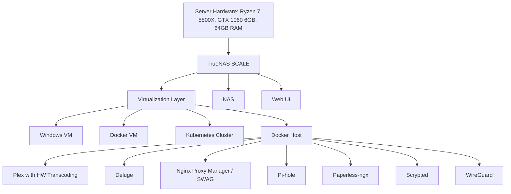

```mermaid
graph TD
    A[Server Hardware: Ryzen 7 5800X, GTX 1060 6GB, 64GB RAM] --> B[TrueNAS SCALE]
    B --> C[Virtualization Layer]
    C --> D[Windows VM]
    C --> E[Docker VM]
    C --> F[Kubernetes Cluster]
    B --> G[NAS]
    B --> H[Web UI]

    C --> I[Docker Host]
    I --> J[Plex with HW Transcoding]
    I --> K[Deluge]
    I --> L[Nginx Proxy Manager / SWAG]
    I --> M[Pi-hole]
    I --> N[Paperless-ngx]
    I --> O[Scrypted]
    I --> P[WireGuard]
```
