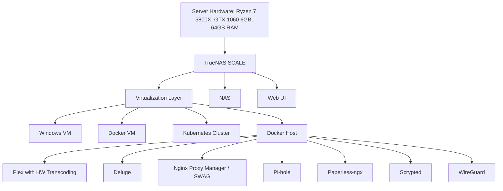

https://de.pcpartpicker.com/list/rddLGP

[PCPartPicker Part List](https://de.pcpartpicker.com/list/rddLGP)

Type|Item|Price
:----|:----|:----
**CPU** | [AMD Ryzen 7 5800X 3.8 GHz 8-Core Processor](https://de.pcpartpicker.com/product/qtvqqs/amd-ryzen-7-5800x-38-ghz-8-core-processor-100-100000063wof) | €156.49 @ Amazon Deutschland 
**Motherboard** | [Asus ROG Strix X570-E Gaming ATX AM4 Motherboard](https://de.pcpartpicker.com/product/CLkgXL/asus-rog-strix-x570-e-gaming-atx-am4-motherboard-rog-strix-x570-e-gaming) |-
**Memory** | [Kingston FURY Beast 64 GB (4 x 16 GB) DDR4-3200 CL16 Memory](https://de.pcpartpicker.com/product/VXwypg/kingston-fury-beast-64-gb-4-x-16-gb-ddr4-3200-cl16-memory-kf432c16bbk464) | €145.89 @ Alternate 
**Storage** | [Intenso Top Performance 256 GB M.2-2280 SATA Solid State Drive](https://de.pcpartpicker.com/product/kW66Mp/intenso-top-performance-256gb-m2-2280-solid-state-drive-3832440) | €17.79 @ Amazon Deutschland 
**Storage** | [Intenso Top Performance 256 GB M.2-2280 SATA Solid State Drive](https://de.pcpartpicker.com/product/kW66Mp/intenso-top-performance-256gb-m2-2280-solid-state-drive-3832440) | €17.79 @ Amazon Deutschland 
**Storage** | [Samsung 870 Evo 1 TB 2.5" Solid State Drive](https://de.pcpartpicker.com/product/7nsnTW/samsung-870-evo-1-tb-25-solid-state-drive-mz-77e1t0bam) | €94.90 @ Computeruniverse 
**Storage** | [Samsung 870 Evo 1 TB 2.5" Solid State Drive](https://de.pcpartpicker.com/product/7nsnTW/samsung-870-evo-1-tb-25-solid-state-drive-mz-77e1t0bam) | €94.90 @ Computeruniverse 
**Storage** | [Seagate Exos X16 12 TB 3.5" 7200 RPM Internal Hard Drive](https://de.pcpartpicker.com/product/FWmFf7/seagate-exos-x16-12-tb-35-7200rpm-internal-hard-drive-st12000nm001g) | €249.99 @ Amazon Deutschland 
**Storage** | [Seagate Exos X16 12 TB 3.5" 7200 RPM Internal Hard Drive](https://de.pcpartpicker.com/product/FWmFf7/seagate-exos-x16-12-tb-35-7200rpm-internal-hard-drive-st12000nm001g) | €249.99 @ Amazon Deutschland 
**Storage** | [Seagate Exos X16 12 TB 3.5" 7200 RPM Internal Hard Drive](https://de.pcpartpicker.com/product/FWmFf7/seagate-exos-x16-12-tb-35-7200rpm-internal-hard-drive-st12000nm001g) | €249.99 @ Amazon Deutschland 
**Storage** | [Seagate Exos X16 12 TB 3.5" 7200 RPM Internal Hard Drive](https://de.pcpartpicker.com/product/FWmFf7/seagate-exos-x16-12-tb-35-7200rpm-internal-hard-drive-st12000nm001g) | €249.99 @ Amazon Deutschland 
**Video Card** | [MSI GeForce GTX 1060 6GT OCV1 GeForce GTX 1060 6GB 6 GB Video Card](https://de.pcpartpicker.com/product/TrGj4D/msi-geforce-gtx-1060-6gb-6gb-gt-ocv1-video-card-geforce-gtx-1060-6gt-ocv1) |-
**Case** | [Thermaltake Suppressor F51 ATX Mid Tower Case](https://de.pcpartpicker.com/product/ZfqPxr/thermaltake-suppressor-f51-atx-mid-tower-case-ca-1e1-00m1wn-03) |-
**Power Supply** | [be quiet! System Power 10 550 W 80+ Bronze Certified ATX Power Supply](https://de.pcpartpicker.com/product/TMBG3C/be-quiet-system-power-10-550-w-80-bronze-certified-atx-power-supply-bn327) | €55.86 @ Galaxus 
**Optical Drive** | [LG WH14NS40 Blu-Ray/DVD/CD Writer](https://de.pcpartpicker.com/product/z2dqqs/lg-optical-drive-wh14ns40) |-
**Wired Network Adapter** | [Asus XG-C100C 10 Gb/s Ethernet PCIe x4 Network Adapter](https://de.pcpartpicker.com/product/7z4NnQ/asus-xg-c100c-network-adapter-xg-c100c) | €76.90 @ Amazon Deutschland 
 | *Prices include shipping, taxes, rebates, and discounts* |
 | **Total** | **€1660.48**
 | Generated by [PCPartPicker](https://pcpartpicker.com) 2024-07-10 21:48 CEST+0200 |
